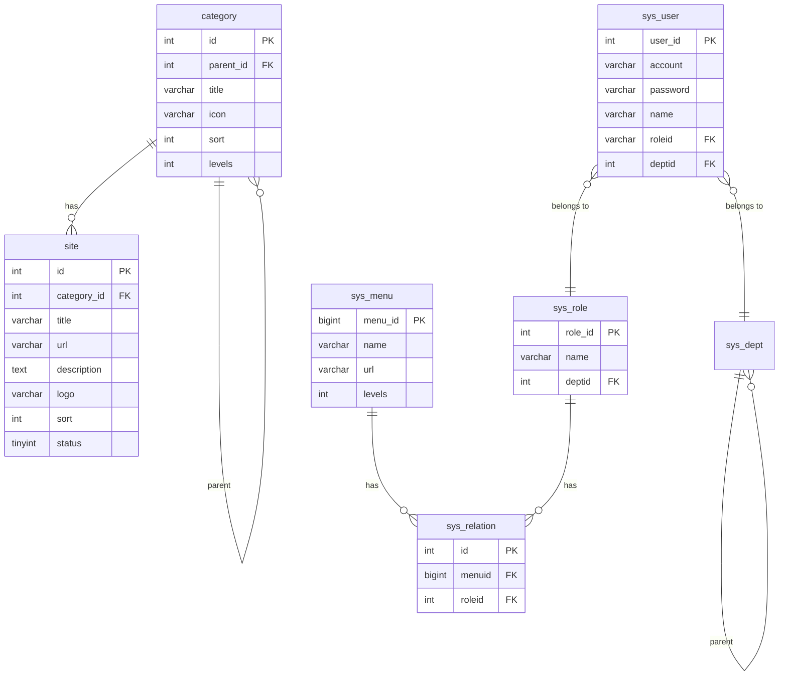

# 数据库设计

## 🗄️ 数据库概述

MyNavications 使用 MySQL 8.0+ 作为主数据库，采用 UTF8MB4 字符集，支持完整的 Unicode 字符。数据库设计遵循第三范式，确保数据的一致性和完整性。

## 📊 数据库表结构

### 核心业务表

#### 1. category - 网站分类表
```sql
CREATE TABLE `category` (
  `id` int(10) unsigned NOT NULL AUTO_INCREMENT COMMENT '分类ID',
  `parent_id` int(11) NOT NULL DEFAULT '0' COMMENT '父分类ID',
  `sort` int(11) NOT NULL DEFAULT '0' COMMENT '排序',
  `title` varchar(50) NOT NULL COMMENT '分类名称',
  `icon` varchar(20) NOT NULL COMMENT '图标',
  `levels` int(11) DEFAULT NULL COMMENT '层级',
  `create_time` timestamp NULL DEFAULT NULL COMMENT '创建时间',
  `update_time` timestamp NULL DEFAULT NULL COMMENT '更新时间',
  PRIMARY KEY (`id`) USING BTREE
) ENGINE=InnoDB DEFAULT CHARSET=utf8mb4 COMMENT='网站分类表';
```

**字段说明**：
- `id`: 主键，自增ID
- `parent_id`: 父分类ID，支持多级分类
- `sort`: 排序字段，数值越小越靠前
- `title`: 分类名称
- `icon`: Font Awesome图标类名
- `levels`: 分类层级，1为顶级分类
- `create_time`: 创建时间
- `update_time`: 更新时间

#### 2. site - 网站信息表
```sql
CREATE TABLE `site` (
  `id` int(10) unsigned NOT NULL AUTO_INCREMENT COMMENT '网站ID',
  `category_id` int(11) NOT NULL COMMENT '分类ID',
  `title` varchar(100) NOT NULL COMMENT '网站标题',
  `url` varchar(255) NOT NULL COMMENT '网站链接',
  `description` text COMMENT '网站描述',
  `logo` varchar(255) DEFAULT NULL COMMENT '网站LOGO',
  `sort` int(11) NOT NULL DEFAULT '0' COMMENT '排序',
  `status` tinyint(1) NOT NULL DEFAULT '1' COMMENT '状态：1启用，0禁用',
  `create_time` timestamp NULL DEFAULT NULL COMMENT '创建时间',
  `update_time` timestamp NULL DEFAULT NULL COMMENT '更新时间',
  PRIMARY KEY (`id`) USING BTREE,
  KEY `idx_category_id` (`category_id`) USING BTREE,
  KEY `idx_status` (`status`) USING BTREE
) ENGINE=InnoDB DEFAULT CHARSET=utf8mb4 COMMENT='网站信息表';
```

**字段说明**：
- `id`: 主键，自增ID
- `category_id`: 关联分类表的ID
- `title`: 网站标题
- `url`: 网站链接地址
- `description`: 网站详细描述
- `logo`: 网站LOGO图片地址
- `sort`: 在分类中的排序
- `status`: 启用状态

### 系统管理表

#### 3. sys_user - 系统用户表
```sql
CREATE TABLE `sys_user` (
  `user_id` int(11) NOT NULL AUTO_INCREMENT COMMENT '主键ID',
  `avatar` varchar(255) DEFAULT NULL COMMENT '头像',
  `account` varchar(45) DEFAULT NULL COMMENT '账号',
  `password` varchar(45) DEFAULT NULL COMMENT '密码',
  `salt` varchar(45) DEFAULT NULL COMMENT 'md5密码盐',
  `name` varchar(45) DEFAULT NULL COMMENT '名字',
  `birthday` datetime DEFAULT NULL COMMENT '生日',
  `sex` int(11) DEFAULT NULL COMMENT '性别',
  `email` varchar(45) DEFAULT NULL COMMENT '电子邮件',
  `phone` varchar(45) DEFAULT NULL COMMENT '电话',
  `roleid` varchar(255) DEFAULT NULL COMMENT '角色ID',
  `deptid` int(11) DEFAULT NULL COMMENT '部门ID',
  `status` int(11) DEFAULT NULL COMMENT '状态',
  `createtime` datetime DEFAULT NULL COMMENT '创建时间',
  `version` int(11) DEFAULT NULL COMMENT '保留字段',
  PRIMARY KEY (`user_id`) USING BTREE
) ENGINE=InnoDB DEFAULT CHARSET=utf8mb4 COMMENT='系统用户表';
```

#### 4. sys_role - 系统角色表
```sql
CREATE TABLE `sys_role` (
  `role_id` int(11) NOT NULL AUTO_INCREMENT COMMENT '主键ID',
  `num` int(11) DEFAULT NULL COMMENT '序号',
  `pid` int(11) DEFAULT NULL COMMENT '父角色ID',
  `name` varchar(255) DEFAULT NULL COMMENT '角色名称',
  `deptid` int(11) DEFAULT NULL COMMENT '部门名称',
  `tips` varchar(255) DEFAULT NULL COMMENT '提示',
  `version` int(11) DEFAULT NULL COMMENT '保留字段',
  PRIMARY KEY (`role_id`) USING BTREE
) ENGINE=InnoDB DEFAULT CHARSET=utf8mb4 COMMENT='系统角色表';
```

#### 5. sys_menu - 系统菜单表
```sql
CREATE TABLE `sys_menu` (
  `menu_id` bigint(20) NOT NULL AUTO_INCREMENT COMMENT '主键ID',
  `code` varchar(255) DEFAULT NULL COMMENT '菜单编号',
  `pcode` varchar(255) DEFAULT NULL COMMENT '菜单父编号',
  `pcodes` varchar(255) DEFAULT NULL COMMENT '当前菜单的所有父菜单编号',
  `name` varchar(255) DEFAULT NULL COMMENT '菜单名称',
  `icon` varchar(255) DEFAULT NULL COMMENT '菜单图标',
  `url` varchar(255) DEFAULT NULL COMMENT 'URL地址',
  `num` int(65) DEFAULT NULL COMMENT '排序',
  `levels` int(65) DEFAULT NULL COMMENT '菜单层级',
  `ismenu` int(11) DEFAULT NULL COMMENT '是否是菜单',
  `tips` varchar(255) DEFAULT NULL COMMENT '备注',
  `status` int(65) DEFAULT NULL COMMENT '菜单状态',
  `isopen` int(11) DEFAULT NULL COMMENT '是否打开',
  PRIMARY KEY (`menu_id`) USING BTREE
) ENGINE=InnoDB DEFAULT CHARSET=utf8mb4 COMMENT='系统菜单表';
```

#### 6. sys_dept - 系统部门表
```sql
CREATE TABLE `sys_dept` (
  `dept_id` int(11) NOT NULL AUTO_INCREMENT COMMENT '主键ID',
  `num` int(11) DEFAULT NULL COMMENT '排序',
  `pid` int(11) DEFAULT NULL COMMENT '父部门ID',
  `pids` varchar(255) DEFAULT NULL COMMENT '父级IDS',
  `simplename` varchar(45) DEFAULT NULL COMMENT '简称',
  `fullname` varchar(255) DEFAULT NULL COMMENT '全称',
  `tips` varchar(255) DEFAULT NULL COMMENT '提示',
  `version` int(11) DEFAULT NULL COMMENT '版本',
  PRIMARY KEY (`dept_id`) USING BTREE
) ENGINE=InnoDB DEFAULT CHARSET=utf8mb4 COMMENT='系统部门表';
```

### 关系表

#### 7. sys_relation - 角色权限关系表
```sql
CREATE TABLE `sys_relation` (
  `id` int(11) NOT NULL AUTO_INCREMENT COMMENT '主键',
  `menuid` bigint(20) DEFAULT NULL COMMENT '菜单ID',
  `roleid` int(11) DEFAULT NULL COMMENT '角色ID',
  PRIMARY KEY (`id`) USING BTREE
) ENGINE=InnoDB DEFAULT CHARSET=utf8mb4 COMMENT='角色权限关系表';
```

### 字典和配置表

#### 8. sys_dict - 系统字典表
```sql
CREATE TABLE `sys_dict` (
  `dict_id` int(11) NOT NULL AUTO_INCREMENT COMMENT '字典ID',
  `num` int(11) DEFAULT NULL COMMENT '排序',
  `pid` int(11) DEFAULT NULL COMMENT '父级字典',
  `name` varchar(255) DEFAULT NULL COMMENT '名称',
  `tips` varchar(255) DEFAULT NULL COMMENT '备注',
  PRIMARY KEY (`dict_id`) USING BTREE
) ENGINE=InnoDB DEFAULT CHARSET=utf8mb4 COMMENT='系统字典表';
```

#### 9. sys_notice - 系统通知表
```sql
CREATE TABLE `sys_notice` (
  `notice_id` int(11) NOT NULL AUTO_INCREMENT COMMENT '主键',
  `title` varchar(255) DEFAULT NULL COMMENT '标题',
  `content` text COMMENT '内容',
  `createtime` datetime DEFAULT NULL COMMENT '创建时间',
  `creater` int(11) DEFAULT NULL COMMENT '创建者',
  PRIMARY KEY (`notice_id`) USING BTREE
) ENGINE=InnoDB DEFAULT CHARSET=utf8mb4 COMMENT='系统通知表';
```

### 日志表

#### 10. sys_operation_log - 操作日志表
```sql
CREATE TABLE `sys_operation_log` (
  `id` int(65) NOT NULL AUTO_INCREMENT COMMENT '主键',
  `logtype` varchar(32) DEFAULT NULL COMMENT '日志类型',
  `logname` varchar(255) DEFAULT NULL COMMENT '日志名称',
  `userid` int(65) DEFAULT NULL COMMENT '用户ID',
  `classname` varchar(255) DEFAULT NULL COMMENT '类名称',
  `method` text COMMENT '方法名称',
  `createtime` datetime DEFAULT NULL COMMENT '创建时间',
  `succeed` varchar(32) DEFAULT NULL COMMENT '是否成功',
  `message` text COMMENT '备注',
  PRIMARY KEY (`id`) USING BTREE
) ENGINE=InnoDB DEFAULT CHARSET=utf8mb4 COMMENT='操作日志表';
```

#### 11. sys_login_log - 登录日志表
```sql
CREATE TABLE `sys_login_log` (
  `id` int(65) NOT NULL AUTO_INCREMENT COMMENT '主键',
  `logname` varchar(255) DEFAULT NULL COMMENT '日志名称',
  `userid` int(65) DEFAULT NULL COMMENT '管理员ID',
  `createtime` datetime DEFAULT NULL COMMENT '创建时间',
  `succeed` varchar(16) DEFAULT NULL COMMENT '是否执行成功',
  `message` text COMMENT '具体消息',
  `ip` varchar(30) DEFAULT NULL COMMENT 'IP地址',
  PRIMARY KEY (`id`) USING BTREE
) ENGINE=InnoDB DEFAULT CHARSET=utf8mb4 COMMENT='登录日志表';
```

## 🔗 表关系图



## 📈 数据库索引策略

### 主键索引
所有表都使用自增整型作为主键，确保查询性能。

### 外键索引
```sql
-- 网站表分类索引
ALTER TABLE site ADD INDEX idx_category_id (category_id);

-- 网站表状态索引
ALTER TABLE site ADD INDEX idx_status (status);

-- 用户表角色索引
ALTER TABLE sys_user ADD INDEX idx_roleid (roleid);

-- 用户表部门索引
ALTER TABLE sys_user ADD INDEX idx_deptid (deptid);

-- 关系表组合索引
ALTER TABLE sys_relation ADD INDEX idx_role_menu (roleid, menuid);
```

### 复合索引
```sql
-- 分类表父级+排序索引
ALTER TABLE category ADD INDEX idx_parent_sort (parent_id, sort);

-- 网站表分类+排序索引
ALTER TABLE site ADD INDEX idx_category_sort (category_id, sort);

-- 日志表时间索引
ALTER TABLE sys_operation_log ADD INDEX idx_createtime (createtime);
ALTER TABLE sys_login_log ADD INDEX idx_createtime (createtime);
```

## 🔧 数据库配置优化

### MySQL 配置建议
```ini
[mysqld]
# 字符集配置
character-set-server=utf8mb4
collation-server=utf8mb4_unicode_ci

# 连接数配置
max_connections=1000
max_connect_errors=1000000

# 缓存配置
query_cache_size=268435456
query_cache_type=1

# InnoDB配置
innodb_buffer_pool_size=1G
innodb_log_file_size=256M
innodb_flush_log_at_trx_commit=2
innodb_lock_wait_timeout=50

# 慢查询日志
slow_query_log=1
long_query_time=2
```

### 连接池配置
```yaml
spring:
  datasource:
    hikari:
      maximum-pool-size: 20
      minimum-idle: 5
      connection-timeout: 30000
      idle-timeout: 600000
      max-lifetime: 1800000
      leak-detection-threshold: 60000
```

## 📊 数据初始化

### 默认管理员用户
```sql
INSERT INTO sys_user (account, password, salt, name, status, createtime) 
VALUES ('admin', '8c6976e5b5410415bde908bd4dee15dfb167a9c873fc4bb8a81f6f2ab448a918', 
        'kgtko', '管理员', 1, NOW());
```

### 默认分类数据
```sql
INSERT INTO category (parent_id, sort, title, icon, levels, create_time) VALUES
(0, 1, '常用推荐', 'fa-star-o', 1, NOW()),
(0, 2, '社区资讯', 'fa-bullhorn', 1, NOW()),
(0, 3, '灵感采集', 'fa-lightbulb-o', 1, NOW()),
(0, 4, '素材资源', 'fa-thumbs-o-up', 1, NOW());
```

### 系统菜单数据
```sql
INSERT INTO sys_menu (code, name, icon, url, num, levels, ismenu, status) VALUES
('system', '系统管理', 'fa-cogs', '#', 1, 1, 1, 1),
('mgr', '用户管理', 'fa-users', '/mgr', 2, 2, 1, 1),
('role', '角色管理', 'fa-user-secret', '/role', 3, 2, 1, 1);
```

## 🔍 查询优化建议

### 1. 分页查询优化
```sql
-- 避免使用 OFFSET，使用游标分页
SELECT * FROM site WHERE id > ? ORDER BY id LIMIT 20;

-- 使用覆盖索引优化
SELECT id, title FROM site WHERE category_id = ? ORDER BY sort LIMIT 20;
```

### 2. 连表查询优化
```sql
-- 使用索引优化连表查询
SELECT s.*, c.title as category_name 
FROM site s 
INNER JOIN category c ON s.category_id = c.id 
WHERE s.status = 1 
ORDER BY s.sort;
```

### 3. 统计查询优化
```sql
-- 使用索引进行统计
SELECT category_id, COUNT(*) as site_count 
FROM site 
WHERE status = 1 
GROUP BY category_id;
```

## 🛠️ 数据库维护

### 备份策略
```bash
# 每日备份
mysqldump -u root -p --single-transaction --routines --triggers webstack > backup_$(date +%Y%m%d).sql

# 增量备份
mysqlbinlog --start-datetime="2025-09-09 00:00:00" /var/log/mysql/mysql-bin.000001 > incremental_backup.sql
```

### 清理策略
```sql
-- 清理30天前的操作日志
DELETE FROM sys_operation_log WHERE createtime < DATE_SUB(NOW(), INTERVAL 30 DAY);

-- 清理90天前的登录日志
DELETE FROM sys_login_log WHERE createtime < DATE_SUB(NOW(), INTERVAL 90 DAY);
```

## 📝 数据字典

### 状态码说明
| 字段 | 值 | 说明 |
|------|----|----|
| site.status | 1 | 启用 |
| site.status | 0 | 禁用 |
| sys_user.status | 1 | 正常 |
| sys_user.status | 2 | 冻结 |
| sys_user.status | 3 | 删除 |
| sys_menu.ismenu | 1 | 菜单 |
| sys_menu.ismenu | 0 | 按钮 |

### 性别编码
| 值 | 说明 |
|----|----| 
| 1 | 男 |
| 2 | 女 |

---

*最后更新: 2025年9月9日*
